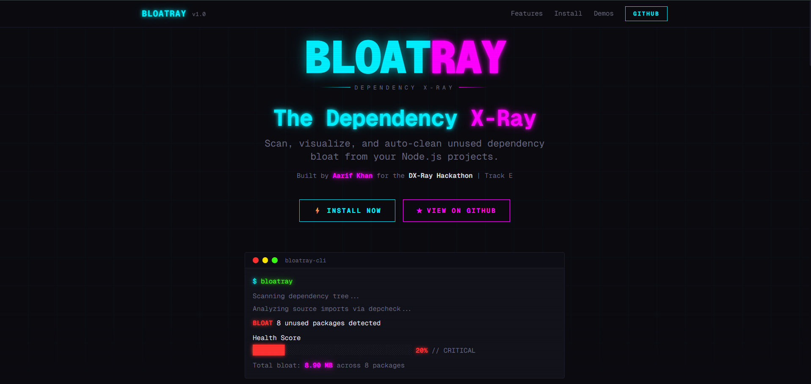
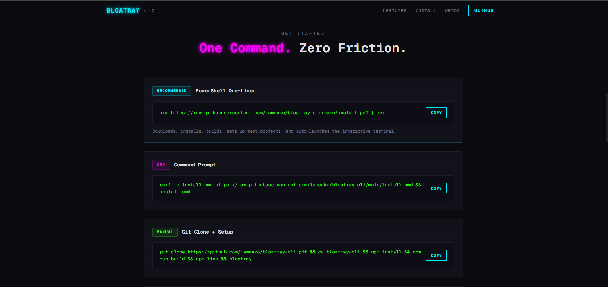
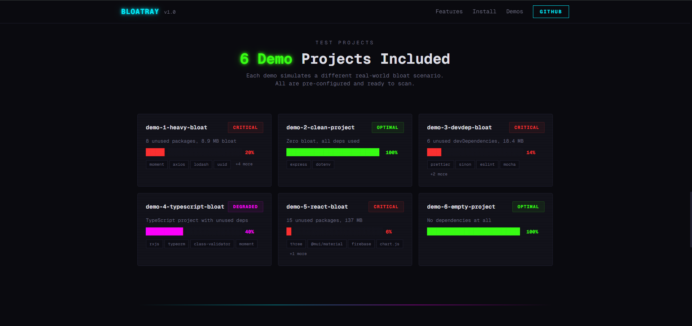

<div align="center">

<pre>
██████╗ ██╗      ██████╗  █████╗ ████████╗██████╗  █████╗ ██╗   ██╗
██╔══██╗██║     ██╔═══██╗██╔══██╗╚══██╔══╝██╔══██╗██╔══██╗╚██╗ ██╔╝
██████╔╝██║     ██║   ██║███████║   ██║   ██████╔╝███████║ ╚████╔╝ 
██╔══██╗██║     ██║   ██║██╔══██║   ██║   ██╔══██╗██╔══██║  ╚██╔╝  
██████╔╝███████╗╚██████╔╝██║  ██║   ██║   ██║  ██║██║  ██║   ██║   
╚═════╝ ╚══════╝ ╚═════╝ ╚═╝  ╚═╝   ╚═╝   ╚═╝  ╚═╝╚═╝  ╚═╝   ╚═╝
</pre>

### The Dependency X-Ray

**Scan. Visualize. Auto-Clean.**

[](https://nodejs.org)
[](https://www.typescriptlang.org)
[](LICENSE)
[](https://github.com/iamaako/bloatray-cli)

</div>

---

<p align="center">
  
  
</p>
<p align="center">
  
</p>

---

## 🔍 What Is BloatRay?

BloatRay is a CLI tool that scans your Node.js project, finds **unused dependencies** hiding in your `node_modules`, shows you exactly how much disk space they waste, and lets you **auto-remove** them in one click.

> Built by **Aarif Khan** for the **DX-Ray Hackathon** — Track E: Dependency X-Ray

---

## 🧠 The 3 Core Questions

| # | Question | Answer |
|---|---|---|
| 🔎 | **What DX problem am I scanning?** | Hidden dependency bloat — unused packages that slow CI/CD, waste disk, and confuse developers. |
| 📊 | **What does my tool output?** | A CLI dashboard with health score, bloat size, impact bars, ranked table, and 1-click cleanup. |
| 📦 | **Where does the data come from?** | `package.json` + source code import analysis via `depcheck` + real `node_modules` size calculation. |

---

## ⚡ How It Works

```
┌─────────────────────────────────────────────────────────────────┐
│                        BloatRay Pipeline                        │
├─────────────────────────────────────────────────────────────────┤
│                                                                 │
│   📦 package.json         🔎 SCAN                               │
│       +                  ──────────►  Find unused packages      │
│   📁 source files                     Calculate real disk size  │
│                                                                 │
│                           📊 VISUALIZE                          │
│                          ──────────►  Health Score (0-100%)     │
│                                       Impact bars + table       │
│                                       Total MB of bloat         │
│                                                                 │
│                           🧹 ACT                                │
│                          ──────────►  npm uninstall (auto)      │
│                                       1-click cleanup           │
│                                                                 │
└─────────────────────────────────────────────────────────────────┘
```

| Step | What Happens |
|---|---|
| 🔎 **SCAN** | Reads `package.json`, analyzes all imports with `depcheck`, calculates real `node_modules` size per package |
| 📊 **VISUALIZE** | Renders health score bar, color-coded impact bars, ranked bloat table, total waste in MB |
| 🧹 **ACT** | Prompts to auto-remove unused packages via `npm uninstall` — clean your project in one click |

---

## 🚀 Quick Install

### Recommended — One-Liner

```powershell
irm https://raw.githubusercontent.com/iamaako/bloatray-cli/main/install.ps1 | iex
```

This single command will clone, install, build, setup demos, and auto-launch the interactive terminal.

### CMD (Command Prompt)

```cmd
curl -o install.cmd https://raw.githubusercontent.com/iamaako/bloatray-cli/main/install.cmd && install.cmd
```

### Manual Setup

```bash
git clone https://github.com/iamaako/bloatray-cli.git
cd bloatray-cli
npm install
npm run build
npm link        # registers 'bloatray' as a global command
bloatray        # run from anywhere
```

---

## 🎮 Usage

```bash
bloatray                                    # Interactive mode (folder picker + action menu)
bloatray scan --dir ./my-project            # Scan a specific project
bloatray fix --dir ./my-project             # Scan + auto-fix
```

---

## 🧪 6 Demo Projects Included

Pre-built test scenarios inside `test-projects/`:

| Demo | Scenario | Health Score |
|---|---|---|
| `demo-1-heavy-bloat` | Express app, 8 unused deps, ~8.9 MB wasted | 🔴 ~20% |
| `demo-2-clean-project` | All deps used, zero bloat | 🟢 100% |
| `demo-3-devdep-bloat` | Unused devDependencies (eslint, prettier, etc.) | 🔴 ~14% |
| `demo-4-typescript-bloat` | TypeScript project with mixed unused deps | 🟡 ~40% |
| `demo-5-react-bloat` | React app, 15 deps, only 4 used | 🔴 ~6% |
| `demo-6-empty-project` | Zero dependencies (edge case) | 🟢 100% |

```bash
npm run test:demo1    # Run any demo
npm run test:demo2
# ...etc
```

---

## 🛠️ Tech Stack

| Technology | Role |
|---|---|
|  | Runtime |
|  | Type safety |
|  | CLI framework |
|  | Unused dep detection |
|  | Interactive terminal UI |
|  | Terminal colors |
|  | Showcase website |
|  | Website styling |

---

## 📁 Project Structure

```
bloatray-cli/
├── src/
│   ├── index.ts          # CLI entry point + Commander setup
│   ├── scanner.ts        # depcheck + node_modules size calc
│   ├── fixer.ts          # npm uninstall auto-cleanup
│   └── ui.ts             # Terminal UI + health score bars
├── test-projects/        # 6 demo projects
├── website/              # Showcase site (Next.js + Tailwind)
├── screenshots/          # README images
├── install.ps1           # PowerShell one-liner installer
├── install.cmd           # CMD installer
├── setup.js              # Node.js setup script
├── package.json
└── tsconfig.json
```

---

<div align="center">

**MIT** — Built with ❤️ by **Aarif Khan** for the DX-Ray Hackathon

[⬆ Back to Top](#)

</div>
